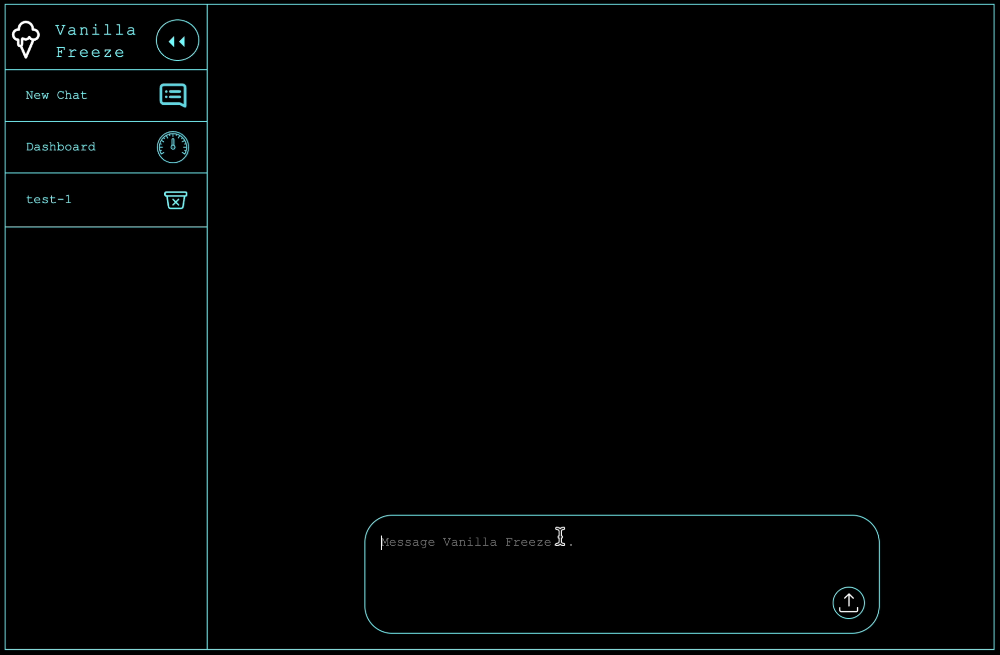

<a id="readme-top"></a>

<div align="center">
  <a href="https://github.com/othneildrew/Best-README-Template">
    
  </a>
  <h3 align="center">Multi-Model Chatbot</h3>

  <p align="center">
    A genAI chat interface fueled by the pure frustration of a CS major.
    <!---
    <br />
    <br />
    <br />
    <a href="https://github.com/othneildrew/Best-README-Template">View Demo</a>
  --->
  </p>
</div>


## About The Project
<div align="center">

</div>
<br />
I often use the assistance of DeepSeek with my Japanese studies, especially creating test questions, flash cards and correcting assignments.
However, I found the "f2p" platform to be constantly suffering from outages. 
Therefore, I decided to build my own interface through which I can speak to DeepSeek.


## Built With

<p align="center">
  <a href="https://skillicons.dev">
    
  </a>
</p>

<p align="right">(<a href="#readme-top">back to top</a>)</p>

## Important Notes

   - The current, "V1" version of Vanilla Freeze is rather raw. I am just getting familiar with Langchain.
   - You can only have 20 chats saved, if you reach that amount, you have to delete older conversations before creating new ones.
   - Its text output is not formatted, there are a few known chat-deletion issues. (most can be solved by refreshing the page)
   - Also, please add .env in your .gitignore file if you publish the repo, to keep your API Keys safe.

I plan to release updates once in a while, altough my current semester in uni is absolutely brutal.

## Getting Started

Starting up the application is pretty straightforward.

### Prerequisites

Python and Pip are needed on your computer.

### Installation

_To use this app, you will need at least one functioning API key from one of the providers._
_OpenAI, Deepseek and Claude are pre-loaded in the app._


1. Get an API key from either
   - OpenAI (https://openai.com/index/openai-api/)
   - DeepSeek (https://platform.deepseek.com/)
   - Anthropic (https://www.anthropic.com/api)
   
2. Fork/Clone the repo
   ```sh
   git clone https://github.com/Vndrvs/Vanilla-Freeze-MultiModel-Chat.git
   ```
3. Navigate to the project directory
   ```sh
   cd Vanilla-Freeze-MultiModel-Chat
   ```
4. Create a virtual environment:
   ```sh
   python -m venv venv
   ```
5. Activate virtual environment:

  Mac/Linux:
   ```sh
   source venv/bin/activate
   ```
  Windows:
   ```sh
   venv\Scripts\activate
   ```
6. Install dependencies:
   ```sh
   pip install -r requirements.txt
   ```
7. Change git remote url to avoid accidental pushes to the base project
   ```sh
   git remote set-url origin your_username/your_reponame
   git remote -v # confirm the changes
   ```
8. Create .env file in the root directory, with the following content:
    ```sh
   # OpenAI API Key
   OPENAI_API_KEY=your_openai_api_key_goes_here

   # DeepSeek API Key
   DEEPSEEK_API_KEY=your_deepseek_api_key_goes_here

   # Anthropic API Key
   ANTHROPIC_API_KEY=your_anthropic_api_key_goes_here
   ```
9. Run the app
   ```sh
   flask run
   ```

<p align="right">(<a href="#readme-top">back to top</a>)</p>


## Usage

This bot was originally created for my personal use. Feel free to try, modify, or use it.
Keep in mind that the data 

## Roadmap

- [x] Create conversation functionality
- [x] Chat memory handling (Currently solved with SQLite)
- [ ] Model-switch toggle button
- [ ] Bot message formatting
- [ ] File upload handling
- [ ] Light mode / Dark mode toggle button
- [ ] Dashboard development (Token count functions, etc.)
      
<p align="right">(<a href="#readme-top">back to top</a>)</p>


## Contributing

Contributions are what make the open source community such an amazing place to learn, inspire, and create. Any contributions you make are **greatly appreciated**.

If you have a suggestion that would make this better, please fork the repo and create a pull request. You can also simply open an issue with the tag "enhancement".
Don't forget to give the project a star! Thanks again!

1. Fork the Project
2. Create your Feature Branch (`git checkout -b feature/AmazingFeature`)
3. Commit your Changes (`git commit -m 'Add some AmazingFeature'`)
4. Push to the Branch (`git push origin feature/AmazingFeature`)
5. Open a Pull Request

## License

Distributed under the Unlicense License. See `LICENSE` for more information.


<!-- CONTACT -->
## Contact

Andras - vndrvs.dev@gmail.com

<p align="right">(<a href="#readme-top">back to top</a>)</p>


## Acknowledgments

Huge thumbs up to Othneil Drew (https://github.com/othneildrew) for this awesome project readme template. Cheers Mate!
* [Awesome Project README Template](https://github.com/othneildrew/Best-README-Template)

